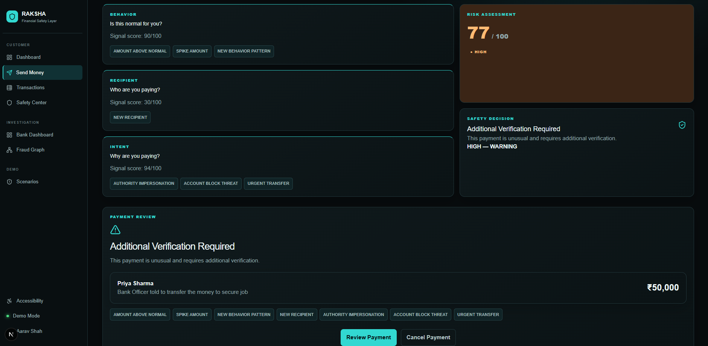
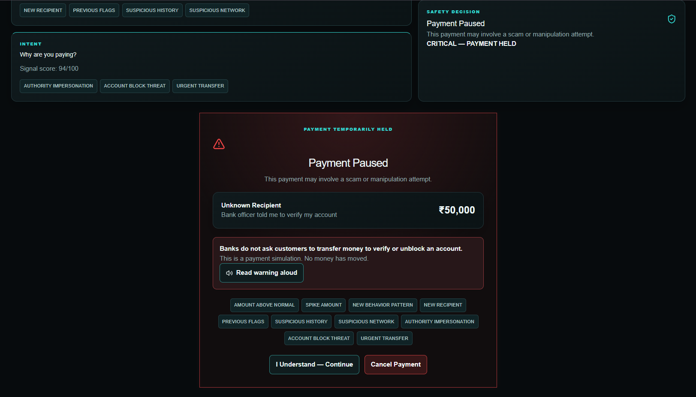
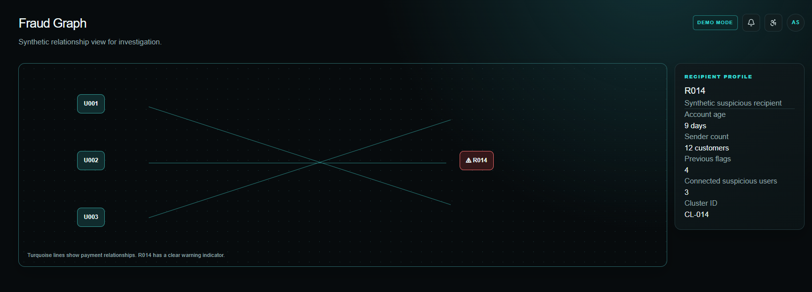

# 🛡️ RAKSHA

## Intent-Aware Financial Safety Layer

> **RAKSHA doesn't just detect fraudulent transactions. It detects when a legitimate customer is being manipulated into making one.**

---
## Product Showcase

RAKSHA connects the customer experience with the bank investigation workflow.

| Customer Safety | Bank Investigation |
|---|---|
|  |  |

### Payment Protection



### Fraud Network



## 1. Problem

Digital financial fraud increasingly exploits human behavior rather than technical vulnerabilities.

A customer may correctly authenticate a transaction while simultaneously being manipulated by:

* fake bank officials
* account-blocking threats
* fake KYC requests
* investment scams
* refund scams
* fake customer support
* urgency and coercion

Traditional fraud systems primarily ask:

> **"Does this transaction look suspicious?"**

RAKSHA asks:

> **"Does this transaction make sense for this customer, this recipient, and this situation?"**

---

# 2. Core Innovation

RAKSHA combines four layers:

```text
BEHAVIOR
"Is this normal for the customer?"

        +

RECIPIENT
"Who is receiving the money?"

        +

INTENT
"Why is the customer making this payment?"

        ↓

RISK ENGINE
"How dangerous is this transaction?"

        ↓

ADAPTIVE FRICTION
"What intervention is appropriate?"
```

Possible outcomes:

```text
ALLOW
VERIFY
STRONG_VERIFY
HOLD
```

---

# 3. Architecture

```text
                    CUSTOMER
                       │
                       ▼
                PAYMENT REQUEST
                       │
                       ▼
                 FASTAPI API
                       │
       ┌───────────────┼────────────────┐
       ▼               ▼                ▼
   BEHAVIOR        RECIPIENT          INTENT
    ENGINE          ENGINE             ENGINE
       │               │                │
       └───────────────┼────────────────┘
                       ▼
                 RISK ENGINE
                       │
                       ▼
              ADAPTIVE FRICTION
                       │
             ┌─────────┼─────────┐
             ▼         ▼         ▼
           ALLOW     VERIFY     HOLD
                                 │
                                 ▼
                          BANK DASHBOARD
                                 │
                                 ▼
                           FRAUD GRAPH
```

---

# 4. Technology Stack

| Layer              | Technology                           |
| ------------------ | ------------------------------------ |
| Frontend           | Next.js + TypeScript                 |
| UI                 | Tailwind CSS + shadcn/ui             |
| API State          | TanStack Query                       |
| Backend            | FastAPI + Python                     |
| Validation         | Pydantic                             |
| Database           | PostgreSQL                           |
| ORM                | SQLAlchemy 2.x                       |
| Migrations         | Alembic                              |
| Cache              | Redis                                |
| Behavior ML        | scikit-learn / Isolation Forest      |
| Recipient Analysis | Python + PostgreSQL                  |
| Fraud Graph        | NetworkX                             |
| Graph UI           | React Flow                           |
| Intent AI          | LLM API through provider abstraction |
| Accessibility      | Web Speech API                       |
| Charts             | Recharts                             |
| Backend Testing    | pytest                               |
| Frontend Testing   | Vitest + Playwright                  |
| Python Quality     | Ruff + Black + mypy                  |
| JS Quality         | ESLint + Prettier                    |
| API                | REST + JSON                          |
| API Documentation  | OpenAPI / Swagger                    |
| Data               | Synthetic deterministic data         |
| CI/CD              | GitHub Actions                       |

---

# 5. Repository Structure

```text
raksha/
│
├── apps/
│   ├── web/
│   └── api/
│
├── packages/
│   └── contracts/
│
├── data/
│   ├── seed/
│   ├── scenarios/
│   └── generated/
│
├── scripts/
│
├── docs/
│   ├── architecture/
│   ├── demo/
│   └── decisions/
│
├── .github/
│   └── workflows/
│
├── CONTRACTS.md
├── README.md
├── .env.example
├── .gitignore
├── LICENSE
└── docker-compose.yml
```

---

# 6. Core Engines

## Behavior Engine

Determines whether a transaction is unusual for the customer.

Inputs include:

* amount
* historical transaction range
* transaction frequency
* time
* recipient frequency
* transaction velocity
* behavioral baseline

Output:

```json
{
  "score": 87,
  "signals": [
    "AMOUNT_ABOVE_NORMAL",
    "UNUSUAL_TIME"
  ]
}
```

---

## Recipient Engine

Determines whether the recipient presents risk.

Checks:

* new recipient
* recipient age
* number of senders
* previous flags
* suspicious transaction history
* suspicious graph relationships

Output:

```json
{
  "score": 76,
  "signals": [
    "NEW_RECIPIENT",
    "SUSPICIOUS_NETWORK"
  ]
}
```

---

## Intent Engine

Determines whether the customer may be experiencing social engineering.

Example:

> "The bank officer told me to transfer ₹50,000 or my account will be blocked."

Possible output:

```json
{
  "category": "BANK_IMPERSONATION",
  "score": 94,
  "signals": [
    "AUTHORITY_IMPERSONATION",
    "ACCOUNT_BLOCK_THREAT",
    "URGENT_TRANSFER"
  ]
}
```

---

# 7. Risk Engine

Initial weighting:

```text
Behavior   = 35%
Recipient  = 25%
Intent     = 40%
```

Base risk:

```text
risk =
    behavior × 0.35
  + recipient × 0.25
  + intent × 0.40
```

Risk levels:

```text
0–30    LOW
31–60   MEDIUM
61–80   HIGH
81–100  CRITICAL
```

High-confidence rules may escalate a transaction beyond the base score.

---

# 8. Adaptive Friction

```text
LOW
→ ALLOW

MEDIUM
→ VERIFY

HIGH
→ STRONG_VERIFY

CRITICAL
→ HOLD
```

Risk detection and customer intervention are separate responsibilities.

---

# 9. Demo Scenarios

### Normal Payment

```text
₹850
Frequent recipient
Normal time
Normal reason
```

Expected:

```text
LOW → ALLOW
```

### Suspicious Payment

```text
₹25,000
New recipient
Unusual time
Unusual amount
```

Expected:

```text
MEDIUM/HIGH → VERIFY
```

### Social Engineering

```text
₹50,000
New recipient
"Bank officer told me my account will be blocked
unless I transfer this immediately."
```

Expected:

```text
CRITICAL → HOLD
```

### Fraud Network

Multiple customers send suspicious transactions to a common recipient.

Expected:

```text
Potential fraud cluster
```

---

# 10. Development Rules

### Never push directly to `main`.

Use:

```text
feature branch
      ↓
Pull Request
      ↓
integration
      ↓
testing
      ↓
main
```

### Never silently change an API contract.

### Never commit secrets.

### Never use real financial/customer data.

### Never make the frontend independently calculate authoritative risk.

### Never allow an individual engine to make the final transaction decision.

---

# 11. Branches

Permanent branches:

```text
main
integration
```

Feature branches:

```text
feature/customer-experience
feature/behavior-engine
feature/recipient-engine
feature/intent-risk
feature/platform-integration
```

Developers should create smaller branches from their ownership branch when appropriate.

---

# 12. Team Ownership

| Person   | Ownership                                    |
| -------- | -------------------------------------------- |
| Person 1 | Customer Experience + Accessibility          |
| Person 2 | Behavior Engine                              |
| Person 3 | Recipient Engine + Fraud Graph               |
| Person 4 | Intent Engine + Risk + Adaptive Friction     |
| Person 5 | Platform + Database + API + Integration + CI |

---

# 13. Definition of Done

A feature is complete only when:

* implementation is complete
* contract is respected
* tests are added where applicable
* lint/type checks pass
* no secrets are committed
* PR is reviewed
* PR is merged into `integration`
* relevant demo scenario works

---

# 14. Important Non-Goals

The hackathon MVP will NOT implement:

* real banking integration
* real UPI transactions
* real customer credentials
* real OTP/PIN collection
* blockchain
* AR/VR
* Kubernetes
* Kafka
* microservices
* custom LLM training

The MVP is a **deterministic financial fraud simulation and intelligence prototype**.

---

# 15. Core Demo Message

> **"Banks already know whether a transaction is authenticated. RAKSHA helps them understand whether the person making it is being manipulated."**
